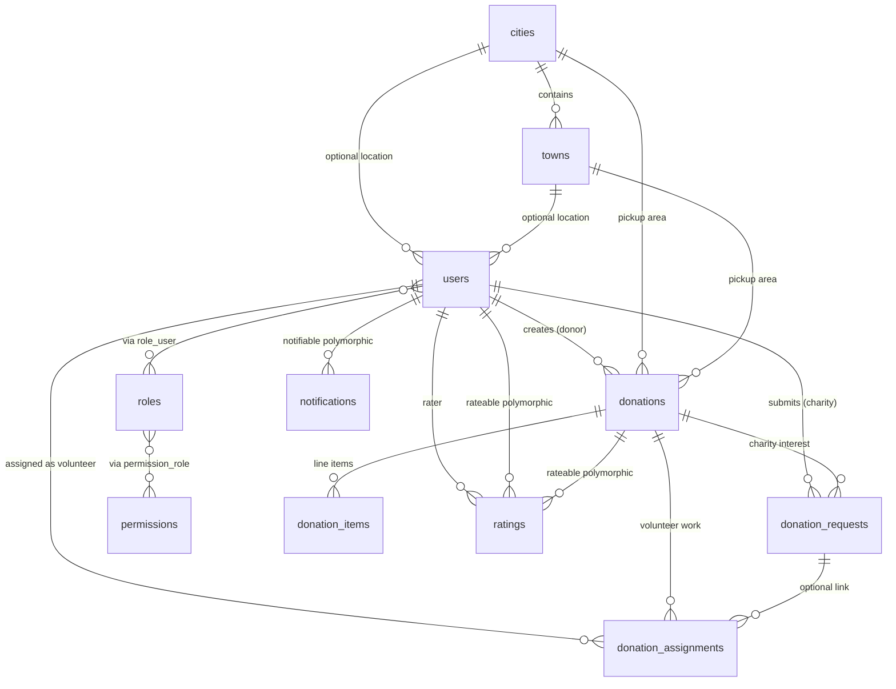

# Rebite database documentation

This document describes **tables**, **naming**, and **relationships** for the RebiteV1 Laravel application. It reflects the schema built by migrations under `database/migrations/`.

---

## Overview diagram

High-level entity relationships (domain tables only):

---

## Core domain tables

### `users`

**Purpose:** All people using the app (admins, donors, charities, volunteers). Role is **not** a column; it comes from **Laratrust** (`roles` + `role_user`).

**Important columns (conceptually):**

| Area | Columns |
|------|---------|
| Auth | `email`, `password`, `remember_token`, `email_verified_at` |
| Profile | `name`, `phone`, `avatar`, `address`, `city` (legacy text), `locale` |
| Location FKs | `city_id` → `cities`, `town_id` → `towns` |
| Moderation | `status` (`pending` / `approved` / `rejected`), `rejection_reason` |
| Role-specific | `role_type` (e.g. volunteer delivery vs packaging), `health_certificate`, `organization_name`, `organization_license` |
| Gamification / billing | `points`; `stripe_customer_id`, `stripe_subscription_id`, `subscription_status`, `subscription_ends_at` (charity Stripe) |

**Relationships:**

- **One user → many** `donations` (`donations.user_id`) — donor’s listings.
- **One user → many** `donation_requests` (`donation_requests.charity_id`) — charity’s requests.
- **One user → many** `donation_assignments` (`donation_assignments.volunteer_id`) — volunteer’s jobs.
- **One user → many** `ratings` as rater (`ratings.rater_id`).
- **Many users ↔ many** `roles` via `role_user`.
- **Optional** `city_id`, `town_id` → `cities`, `towns`.

---

### `cities` and `towns`

**Purpose:** Structured geography (e.g. Jordan). `users.city` / donation text fields can coexist for display; FKs are the normalized link.

| Table | Purpose |
|-------|---------|
| `cities` | One row per city (`name` unique). |
| `towns` | Areas within a city; `city_id` → `cities`, unique `(city_id, name)`. |

**Relationships:**

- `cities` **1 — N** `towns`.
- `cities` / `towns` **1 — N** `users` and **1 — N** `donations` (optional FKs).

---

### `donations`

**Purpose:** A food donation listing created by a **donor** (`user_id`). Drives marketplace, charity requests, and volunteer assignments.

**Notable columns:**

- **Who / where:** `user_id` → `users`, `city_id`, `town_id`, `pickup_address`, `latitude`, `longitude`.
- **What / when:** `food_type` (summary), `description`, `quantity`, `quantity_unit`, `pickup_time`, `expiry_time`, `image`, `notes`.
- **Workflow:** `status` (lifecycle: pending → accepted → … → completed / cancelled).
- **Volunteers:** `volunteers_needed`, `volunteers_count`, `delivery_volunteers_needed`, `packaging_volunteers_needed`.
- **Soft deletes:** `deleted_at`.

**Relationships:**

- **Belongs to** `users` (donor), optional `cities`, `towns`.
- **Has many** `donation_items`, `donation_requests`, `donation_assignments`.
- **Has one** “approved charity request” is a **query scope** in the app (`approvedCharityRequest`), not a separate table.
- **Morph many** `ratings` (`rateable_type` / `rateable_id`).

---

### `donation_items`

**Purpose:** Individual food lines belonging to one donation (multiple items per donation).

- `donation_id` → `donations` (cascade delete).
- Columns: `food_type`, `quantity`, `quantity_unit`, `description`.

**Relationship:** **N — 1** `donations`.

---

### `donation_requests`

**Purpose:** A **charity** asks to receive a specific donation. Admin (or workflow) sets `status` to `pending` / `approved` / `rejected`.

- `donation_id` → `donations` (cascade).
- `charity_id` → `users` (cascade) — the charity account.
- `message` optional note from charity.

**Relationships:**

- **Belongs to** `donations`, `users` (charity).
- **Has many** `donation_assignments` (optional link through `donation_request_id`).

---

### `donation_assignments`

**Purpose:** A **volunteer** (or placeholder) is tied to a donation for **delivery** or **packaging**, with its own status and timestamps.

| Column | Meaning |
|--------|---------|
| `donation_id` | Required; which donation. |
| `donation_request_id` | Optional; if set, ties the row to an approved charity-request flow. |
| `volunteer_id` | Optional; null e.g. external / unassigned placeholder. |
| `assignment_type` | `delivery` or `packaging`. |
| `status` | `pending`, `accepted`, `in_progress`, `completed`, `cancelled`. |
| `pickup_at`, `delivered_at` | Logistics timestamps. |
| `is_external_delivery` | Flag for non-volunteer delivery. |

**Relationships:**

- **Belongs to** `donations`, optional `donation_requests`, optional `users` (volunteer).

---

### `ratings`

**Purpose:** Star ratings and comments. **Polymorphic** target: who/what is rated (`rateable_type`, `rateable_id` — e.g. `User` for volunteers, optionally `Donation`).

- `rater_id` → `users` (who gave the rating).

**Relationships:**

- **Belongs to** `users` (rater).
- **Morph to** `rateable` (e.g. volunteer `User`, or `Donation`).

---

### `notifications`

**Purpose:** Laravel database notifications (`Illuminate\Notifications`).

- `notifiable_type` + `notifiable_id` → usually **`users`**.
- `type`, `data` (JSON payload), `read_at`.

**Relationship:** **Morph** `notifiable` → typically `users`.

---

### `settings`

**Purpose:** Key/value application configuration (limits, points, subscription price in JD, etc.).

- `key` (unique), `value`, `label`, `type`.

No foreign keys; read through the `Setting` model / cache.

---

## Access control (Laratrust)

Laratrust stores roles and permissions in normalized tables; **users do not store `role_id` on `users`**.

| Table | Purpose |
|-------|---------|
| `roles` | Role definition (`name`, `display_name`, …). |
| `permissions` | Permission definition. |
| `role_user` | **Pivot:** `role_id`, `user_id`, `user_type` (supports multi-guard; typically `App\Models\User`). |
| `permission_user` | Direct user permissions (optional). |
| `permission_role` | **Pivot:** which permissions belong to which role. |

**Relationships:**

- **User** ↔ **Role**: many-to-many via `role_user`.
- **Role** ↔ **Permission**: many-to-many via `permission_role`.

---

## Laravel / infrastructure tables

| Table | Purpose |
|-------|---------|
| `password_reset_tokens` | Password reset emails. |
| `personal_access_tokens` | Sanctum API tokens. |
| `failed_jobs` | Failed queue jobs. |
| `jobs` | Queue jobs payload. |
| `job_batches` | Batched jobs metadata. |
| `websockets_statistics_entries` | WebSocket stats (package-related). |

These are **not** business-domain tables but are part of the deployed schema.

---

## Naming conventions

- **Snake_case, plural** table names: `donation_requests`, `donation_assignments`.
- **Foreign keys:** `{model}_id` pointing to parent `id` (`user_id`, `donation_id`, `charity_id`, `volunteer_id`, `city_id`, `town_id`).
- **Pivot tables:** `role_user`, `permission_role` — alphabetical or framework convention (Laratrust).
- **Polymorphic:** `*_type` + `*_id` (`rateable`, `notifiable`).

---

## Quick reference — foreign keys

| Child table | FK column | Parent table |
|-------------|-----------|--------------|
| `towns` | `city_id` | `cities` |
| `donations` | `user_id` | `users` |
| `donations` | `city_id`, `town_id` | `cities`, `towns` |
| `donation_items` | `donation_id` | `donations` |
| `donation_requests` | `donation_id` | `donations` |
| `donation_requests` | `charity_id` | `users` |
| `donation_assignments` | `donation_id` | `donations` |
| `donation_assignments` | `donation_request_id` | `donation_requests` |
| `donation_assignments` | `volunteer_id` | `users` |
| `ratings` | `rater_id` | `users` |
| `role_user` | `user_id` | `users` |
| `role_user` | `role_id` | `roles` |
| `permission_role` | `role_id`, `permission_id` | `roles`, `permissions` |
| `permission_user` | `user_id`, `permission_id` | `users`, `permissions` |

---

## Keeping this doc in sync

- **Source of truth:** `database/migrations/*.php`.
- After adding migrations, update this file and the diagram if new tables or FKs appear.
